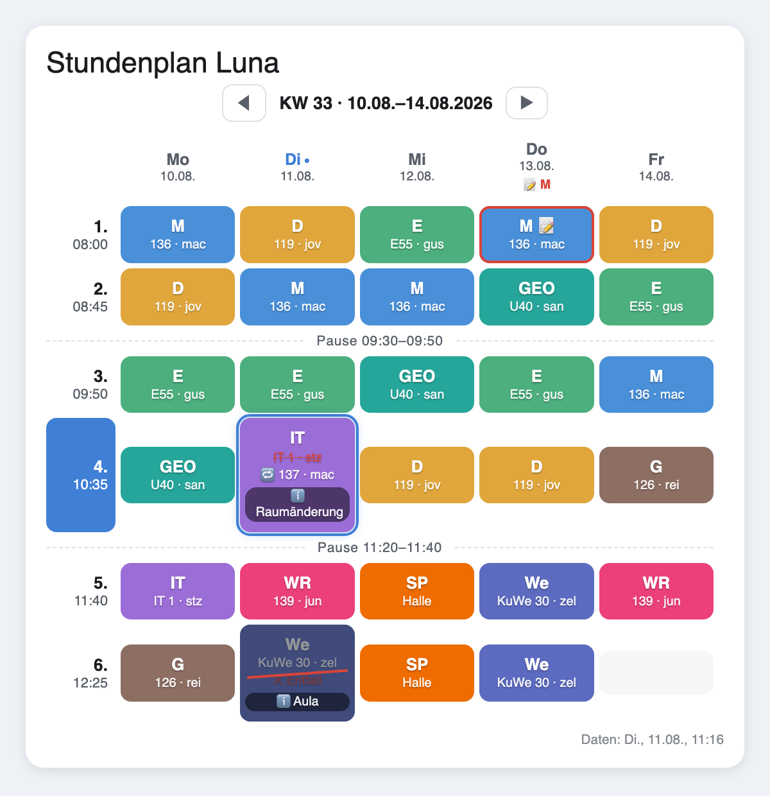
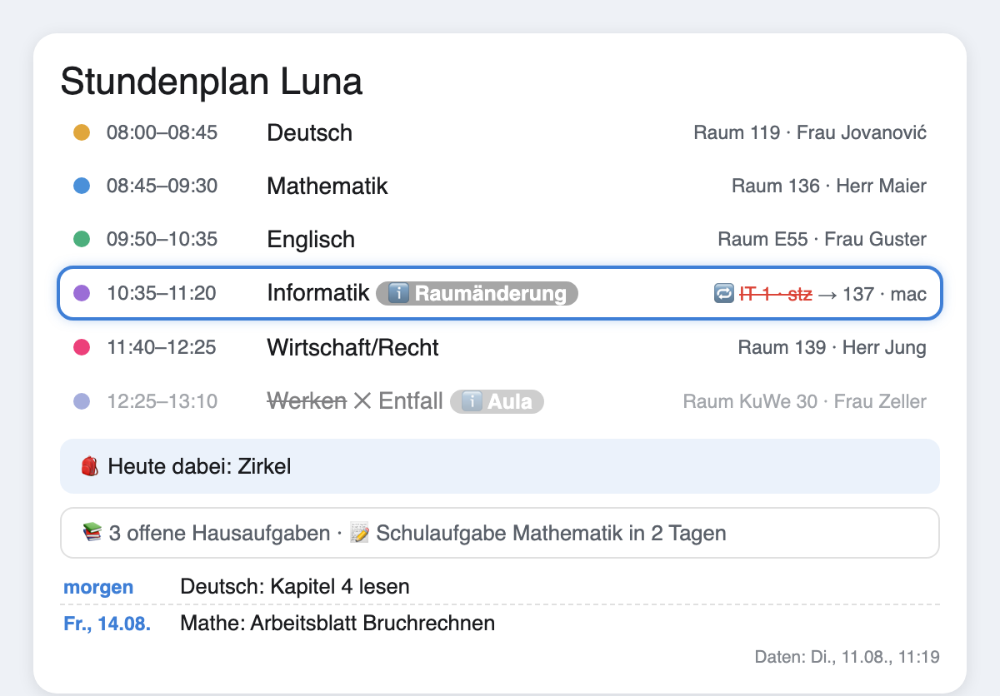
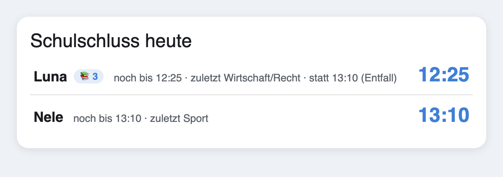

# Handbuch – Stundenplan Manager

Ausführliche Anleitung zum Home-Assistant-Add-on **Stundenplan Manager** und zur zugehörigen **Stundenplan Card**. Für einen schnellen Überblick siehe [README.md](README.md).

## Inhalt

1. [Überblick](#überblick)
2. [Installation](#installation)
3. [Erste Schritte](#erste-schritte)
4. [Fächer](#fächer)
5. [Wochenplan pflegen](#wochenplan-pflegen)
6. [Stundenraster & Pausen](#stundenraster--pausen)
7. [Planversionen (Schuljahreswechsel)](#planversionen-schuljahreswechsel)
8. [Blockunterricht (Azubis)](#blockunterricht-azubis)
9. [Datenquellen: Schulmanager & Eltern-Portal](#datenquellen)
10. [Vertretungen & Entfall](#vertretungen--entfall)
11. [Räume, Lehrer & Lehrer-Klarnamen](#räume-lehrer--lehrer-klarnamen)
12. [Hausaufgaben & Klassenarbeiten](#hausaufgaben--klassenarbeiten)
13. [Schulferien-Integration](#schulferien-integration)
14. [Morgen-Push & Materialliste](#morgen-push--materialliste)
15. [Die Lovelace-Karte](#die-lovelace-karte)
16. [MQTT-Sensoren & Attribute](#mqtt-sensoren--attribute)
17. [Backups, Snapshots & Import rückgängig](#backups-snapshots--import-rückgängig)
18. [Add-on-Optionen](#add-on-optionen)
19. [Tipps & Fehlersuche](#tipps--fehlersuche)

---

## Überblick

Der Stundenplan Manager verwaltet die Wochenpläne mehrerer Kinder in Home Assistant. Die Pflege geschieht in einer Web-Oberfläche (Add-on-Panel „Stundenplan"), die Anzeige über eine Lovelace-Karte und fünf MQTT-Sensoren pro Kind. Optional lässt sich pro Kind eine Schulplattform (**Schulmanager Online** oder **Eltern-Portal**) verknüpfen, aus der Plan, Räume, Lehrer, Vertretungen, Hausaufgaben und Arbeiten übernommen werden.

Alle Daten liegen lokal im Add-on; es werden keine Cloud-Dienste außer den von dir verknüpften Schulplattformen kontaktiert.

## Installation

**Add-on**

1. In Home Assistant: **Einstellungen → Add-ons → Add-on Store → ⋮ → Repositories**
2. `https://github.com/Melle79/ha-stundenplan` hinzufügen
3. „Stundenplan Manager" installieren und starten
4. Das Add-on erscheint als Panel **„Stundenplan"** in der Seitenleiste (Ingress, kein Port nötig)

Voraussetzung ist ein **MQTT-Broker** (z. B. das Mosquitto-Add-on) – darüber werden die Sensoren per Discovery angelegt.

**Karte**

Das Add-on kopiert die Karte beim Start automatisch nach `/config/www/stundenplan-card.js` und registriert ab v1.3.0 die Dashboard-Ressource selbst (inkl. Versions-Cache-Buster). Nach einem Update genügt ein normaler Browser-Reload. Nur bei Dashboards im YAML-Modus muss die Ressource `/local/stundenplan-card.js` manuell eingebunden werden (ein Hinweis erscheint im Add-on-Log).

## Erste Schritte

1. Panel **Stundenplan** öffnen.
2. Tab **Fächer**: Über **📥 Standard-Fächer hinzufügen** die 21 gängigen Fächer laden oder eigene anlegen.
3. Oben ein **Kind hinzufügen** (Chip „+"). Name vergeben.
4. Im Kind-Panel den **Wochenplan** füllen (Zelle anklicken → Fach wählen).
5. Speichern erfolgt automatisch (Auto-Save); die Sensoren aktualisieren sich sofort.
6. Optional die **Karte** aufs Dashboard legen (siehe [unten](#die-lovelace-karte)).

## Fächer

Fächer werden **global** angelegt (alle Kinder teilen sie) und tragen **Kürzel**, **Name**, **Farbe** und optional **Material**. Das Kürzel erscheint im Plan-Raster, Name und Farbe auf der Karte.

- **Kürzel umbenennen**: Ändert das Kürzel in allen Plänen mit.
- **Material** (z. B. „Sportbeutel"): erscheint im Morgen-Push, in der Heute-Ansicht und am Sensor „Erste Stunde morgen".
- **Nicht mehr im Plan**: Fächer, die in keinem aktuellen Plan (inkl. Blöcken) eines Kindes mehr vorkommen, werden abgeblendet, ans Ende sortiert und mit „nicht mehr im Plan" markiert – so lassen sich Altlasten (z. B. nach einem Schulwechsel) mit **✕** aufräumen.

> Räume und Lehrer sind **nicht** global, sondern kindspezifisch – siehe [Räume, Lehrer & Lehrer-Klarnamen](#räume-lehrer--lehrer-klarnamen).

## Wochenplan pflegen

Im Kind-Panel steht das Raster Mo–Fr. Eine Zelle anklicken öffnet die Fachauswahl; erneut die aktuelle Auswahl anklicken leert die Zelle. Änderungen werden automatisch gespeichert.



## Stundenraster & Pausen

Das **Standard-Stundenraster** (Zeiten je Stunde) gilt für alle Kinder und ist im Tab **Einstellungen** pflegbar. Pro Kind lässt sich ein **eigenes Raster** hinterlegen, das das Standardraster überschreibt (nützlich bei abweichenden Anfangszeiten). **Pausen** entstehen automatisch aus Lücken zwischen zwei Stunden (z. B. 09:30 → 09:50) und lassen sich auf der Karte ein-/ausblenden.

Beim Import aus einer Schulplattform mit abweichenden Zeiten wird automatisch ein kindspezifisches Raster angelegt (Merker-Prinzip: ein importiertes Raster folgt späteren Änderungen der Schule, ein von Hand gepflegtes bleibt unangetastet).

## Planversionen (Schuljahreswechsel)

Über **+ Neuer Plan ab …** lässt sich pro Kind eine Planversion mit Gültigkeitsdatum anlegen. Ab dem Stichtag zeigt die Karte automatisch die neue Version; die alte bleibt für Rückblicke erhalten. Die Sensoren und der Import verwenden immer die am jeweiligen Tag gültige Version.

## Blockunterricht (Azubis)

Für Berufsschüler gibt es den **Blockmodus**: Statt eines durchgehenden Wochenplans pflegst du **Blockzeiträume** (von–bis). Außerhalb der Blöcke zeigen Sensoren und Karte **„Betrieb"**. Kinder im Blockmodus sind von der Schulferien-Logik bewusst ausgenommen (in den Ferien ist Betrieb, nicht schulfrei).

## Datenquellen

Optional lässt sich pro Kind eine Schulplattform verknüpfen (Dropdown im Kind-Panel). Import, täglicher Auto-Import, Statusbox und Push funktionieren für beide Quellen gleich.

### Schulmanager Online

Über die HACS-Integration [Schulmanager-homeassistant](https://github.com/MrIcemanLE/Schulmanager-homeassistant):

- **Plan-Import** per Knopfdruck: Wochenplan samt Stundenraster übernehmen, Fächer werden automatisch angelegt. Es werden nur befüllte Tage ersetzt (inkrementell); vor jedem Import entsteht ein Snapshot (Undo möglich).
- **Vertretungen, Entfall, Hausaufgaben und Klassenarbeiten** werden mitgeliefert.
- Lehrer kommen als **Kürzel** (Klarnamen von Hand pflegen, siehe unten).

### Eltern-Portal

Über die HACS-Integration [workFLOw42/Elternportal_API](https://github.com/workFLOw42/Elternportal_API):

- Liefert den kompletten Wochenplan inkl. Räumen, Fachnamen, **Lehrer-Klarnamen** (füllt das Lehrerverzeichnis automatisch) und anstehende Arbeiten.
- **Keine** Vertretungen und **keine** Hausaufgaben.
- Die Integration lädt Daten nur per Service `elternportal.fetch_data`. Das Add-on stößt diesen selbst an (vor Auto-Import, manuellem Import und Abend-Push) und wartet auf Bestätigung – eine eigene HA-Automation ist nicht nötig.

### Auto-Import

Pro Kind aktivierbar (opt-in). Standardmäßig läuft der Import zu drei Zeitpunkten vor Schulbeginn (**06:30, 07:00, 07:15**), einstellbar über `auto_import_zeiten`. So sind morgendliche Vertretungen rechtzeitig auf der Karte.

## Vertretungen & Entfall

Bei verknüpftem **Schulmanager** markiert die Karte für heute und morgen:

- **Entfall**: Zelle abgedunkelt, durchgestrichen, „✕ Entfall"; eine etwaige Info (z. B. „Aula") erscheint als Notiz.
- **Vertretung**: Originalangaben durchgestrichen, neue Angaben hervorgehoben („🔁 Raum/Lehrer/Fach").

**Entfallene Randstunden verschieben die Zeiten**: Fällt die erste oder letzte Stunde aus, zeigen Sensor, Karte und Push den echten Schulbeginn bzw. -schluss („noch bis 11:20 · statt 15:00 (Entfall)"). Fällt der ganze Tag aus, melden die Sensoren „Schulfrei (Entfall)". Reine Fach-/Raum-/Lehrertausche (Vertretung) ändern die Zeiten nicht.

## Räume, Lehrer & Lehrer-Klarnamen

Räume und Lehrer sind **kindspezifisch** (Geschwister an verschiedenen Schulen teilen dieselben Kürzel mit unterschiedlichen Räumen/Lehrern). Sie stehen im Kind-Panel unter **📍 Räume & Lehrer**; der Import füllt und pflegt sie, Handeinträge gewinnen.

**Lehrer-Klarnamen** (Tabelle **👩‍🏫 Lehrernamen** im Kind-Panel):

- Die Lehrer-**Kürzel** werden automatisch aus den Fach-Details entdeckt; den **Klarnamen** trägst du daneben ein.
- Das **Eltern-Portal** füllt die Klarnamen automatisch (und korrigiert sie); **Schulmanager** liefert nur Kürzel, dort pflegst du die Namen von Hand. Handeinträge gewinnen immer.
- Auf der Karte erscheint bei genügend Breite der **Klarname**, sonst das Kürzel (in der Heute-Liste früher als im engeren Wochenraster). Der volle Name steht zusätzlich im Tooltip.
- Kürzel, die im aktuellen Plan nicht mehr vorkommen, werden als **„nicht mehr im Plan"** markiert und lassen sich mit **✕** löschen (kommen bei Bedarf durch den nächsten Import zurück, falls noch unterrichtet).



## Hausaufgaben & Klassenarbeiten

Bei Schulmanager erscheinen offene **Hausaufgaben** (aus der Todo-Liste) und die **nächste Arbeit** in der Heute- und Schulschluss-Ansicht sowie im Morgen-Push. Fällige Hausaufgaben werden mit Datum (heute/morgen/überfällig) gelistet.



## Schulferien-Integration

Im Tab **Einstellungen → Schulferien-Integration** den Kalender-Sensor des [Schulferien & Feiertage Managers](https://github.com/Melle79) auswählen (alle Ferien und Feiertage in einer Entity – ein Feld genügt). Alternativ die Einzelsensoren „Nächste Schulferien" und „Nächster Feiertag".

An schulfreien Tagen zeigen die Sensoren „Schulfrei (Grund)" und die Karte ein Ferien-Banner – auch beim Blättern weit in die Zukunft. Kinder im Blockmodus sind ausgenommen.

## Morgen-Push & Materialliste

Im Tab **Einstellungen** lässt sich ein täglicher Push aktivieren (Uhrzeit + Notify-Gerät wählbar, Test-Button):

> „Luna: Sport um 08:00, Schluss 13:10 – Sportbeutel"

An freien Tagen wird nichts gesendet. Der Push berücksichtigt Entfälle des Folgetags (verschobener Beginn/Schluss) und listet fällige Hausaufgaben und anstehende Arbeiten. **Material** je Fach erscheint im Push, am Sensor „Erste Stunde morgen" (Attribut `material_morgen`) und in der Heute-Ansicht.

## Die Lovelace-Karte

Über den visuellen Editor („Karte hinzufügen" → „Stundenplan Card") oder per YAML:

```yaml
type: custom:stundenplan-card
entities:                # weglassen = alle Kinder automatisch
  - sensor.stundenplan_luna_wochenplan
layout: tabs             # tabs | untereinander (bei mehreren Kindern)
modus: woche             # woche | heute | schulschluss
schrift: normal          # normal | gross
zeige_pausen: true
titel: ""                # optional, Standard: "Stundenplan {Name}"
```

- **modus**
  - `woche`: Wochenraster mit Pausen, laufender Stunde und Vertretungs-Overlay; Blättern per KW.
  - `heute`: Tagesliste mit Räumen, Lehrer-Klarnamen, Material, Hausaufgaben und Arbeit.
  - `schulschluss`: kompakte Zusammenfassung „wie lange geht die Schule heute" über alle Kinder.
- **entities weglassen** = alle gefundenen Kinder automatisch; bei mehreren erscheinen Umschalt-Chips.
- **layout: untereinander** stapelt mehrere Kinder statt Chips.
- **schrift: gross** vergrößert alles (z. B. für Wandtablets).
- Die Karte ist rein **sensorbasiert** und funktioniert daher auch extern via Nabu Casa.

## MQTT-Sensoren & Attribute

Pro Kind werden fünf Sensoren per Discovery angelegt (`sensor.stundenplan_<name>_…`):

| Sensor | Bedeutung |
|--------|-----------|
| `aktuelle_stunde` | Laufende Stunde / Pause / Kein Unterricht / Schulfrei / Betrieb |
| `naechste_stunde` | Nächste belegte Stunde heute |
| `erste_stunde_morgen` | Erste Stunde am nächsten Schultag (Attribut `material_morgen`) |
| `schulschluss_heute` | Ende der letzten stattfindenden Stunde (berücksichtigt Entfall) |
| `wochenplan` | Anzahl Wochenstunden; **Attribute** tragen den kompletten Plan |

Nützliche Attribute (u. a.): `schulbeginn_heute`, `heute_stunden`, `heute_entfall`, `schulschluss_regulaer`/`schulbeginn_regulaer` (nur bei entfallenen Randstunden), `hausaufgaben_offen`, `naechste_arbeit`, `daten_stand` (letzter Schuldaten-Abruf). Der `wochenplan`-Sensor liefert als Attribute u. a. `raster`, `plan`, `plaene`, `faecher`, `lehrer_namen`, `aenderungen`, `arbeiten`, `schulfrei_zeitraeume`.

## Backups, Snapshots & Import rückgängig

- **Vor jedem Import** entsteht ein Snapshot; der letzte Import lässt sich mit **↩ Import rückgängig** zurücknehmen (bis zum Neuladen der Seite; danach greifen die Backups).
- **Tägliche Backups** landen unter `/data/backups`. Zeitpunkt und Anzahl über die Add-on-Optionen `backup_zeit` / `backup_anzahl` (1–30).
- Backups lassen sich in der Web-UI wiederherstellen.

## Add-on-Optionen

| Option | Standard | Bedeutung |
|--------|----------|-----------|
| `log_level` | `info` | Log-Ausführlichkeit (`debug`/`info`/`warning`/`error`) |
| `backup_zeit` | `03:30` | Uhrzeit des täglichen Backups |
| `backup_anzahl` | `7` | Aufbewahrte Backups (1–30) |

Ferien- und Push-Einstellungen werden in der Web-UI gepflegt, nicht in den Add-on-Optionen.

## Tipps & Fehlersuche

- **Portal-Sensoren stehen in den Ferien auf „unknown".** Das Eltern-Portal lädt nur per `fetch_data`; in den Ferien laufen Auto-Import/Push nicht, also fehlt der Auslöser. Kein Fehler – nach Schulstart bzw. beim nächsten Import füllt es sich.
- **Schule gewechselt?** Neue Quelle im Kind-Panel setzen und importieren. Alte Fächer/Lehrerkürzel werden als „nicht mehr im Plan" markiert und lassen sich mit ✕ aufräumen. Beim Wechsel von Eltern-Portal auf Schulmanager musst du die Lehrer-Klarnamen einmalig von Hand eintragen (Schulmanager liefert nur Kürzel).
- **Karte zeigt „Warte auf Plandaten…".** MQTT-Broker prüfen und ob das Add-on läuft; die Sensoren entstehen per Discovery.
- **Karte lädt nicht nach Update.** Normaler Browser-Reload; bei YAML-Dashboards die Ressource `/local/stundenplan-card.js` manuell einbinden.
- **Vertretungen fehlen.** Vertretungen liefert nur Schulmanager, nicht das Eltern-Portal.
